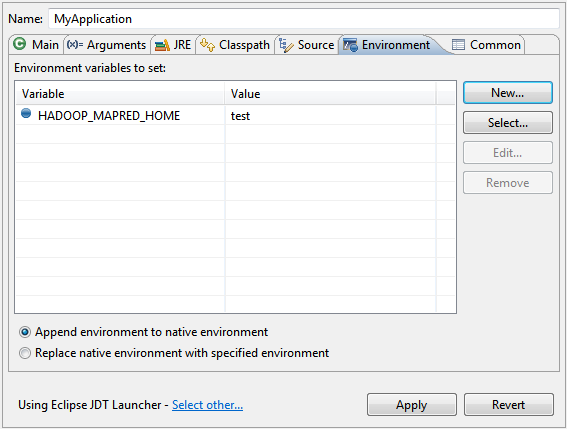

# Start application

## Setup developement environment
* Execute `gradlew clean build` for windows and `./gradlew clean build` for linux to download dependancy
* Import project in eclipse
* Set environment variable
    - Go to **_Run_** -> **_Run Configurations..._** and Select tab `Environment`.
    

    - Add below mentioned environment variables for database.


## Start application in linux/mac

* Execute `./gradlew clean build` to generate war file
* Copy war file from `build/libs/` to tomcat webapp diractory
* Export environment variables and start tomcat server

```
export SERVER_HOSTNAME=<IPADDRESS or HOSTNAME>
export DATABASE_PORT=<PORT>
export DATABASE_NAME=<Name of your DB>
export DB_USER=<Username>
export DB_PASSWORD=<Password>

./startup.sh
```

## Start application from windows

* Execute `gradlew clean build` to generate war file
* Copy war file from `build/libs/` to tomcat webapp diractory
* Export environment variables and start tomcat server

```
set SERVER_HOSTNAME=<IPADDRESS or HOSTNAME>
set DATABASE_PORT=<PORT>
set DATABASE_NAME=<Name of your DB>
set DB_USER=<Username>
set DB_PASSWORD=<Password>

./startup.bat
```

